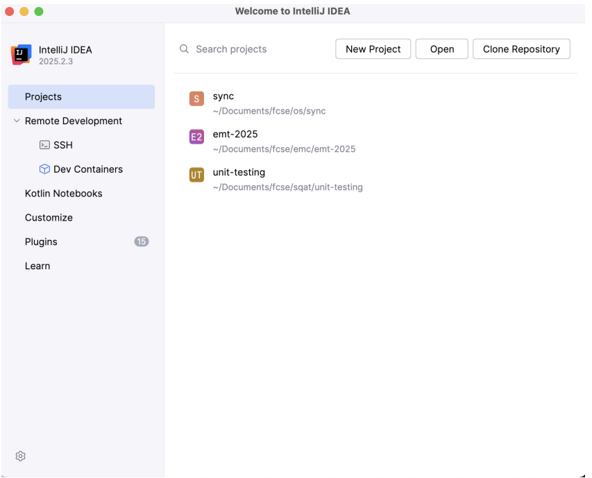
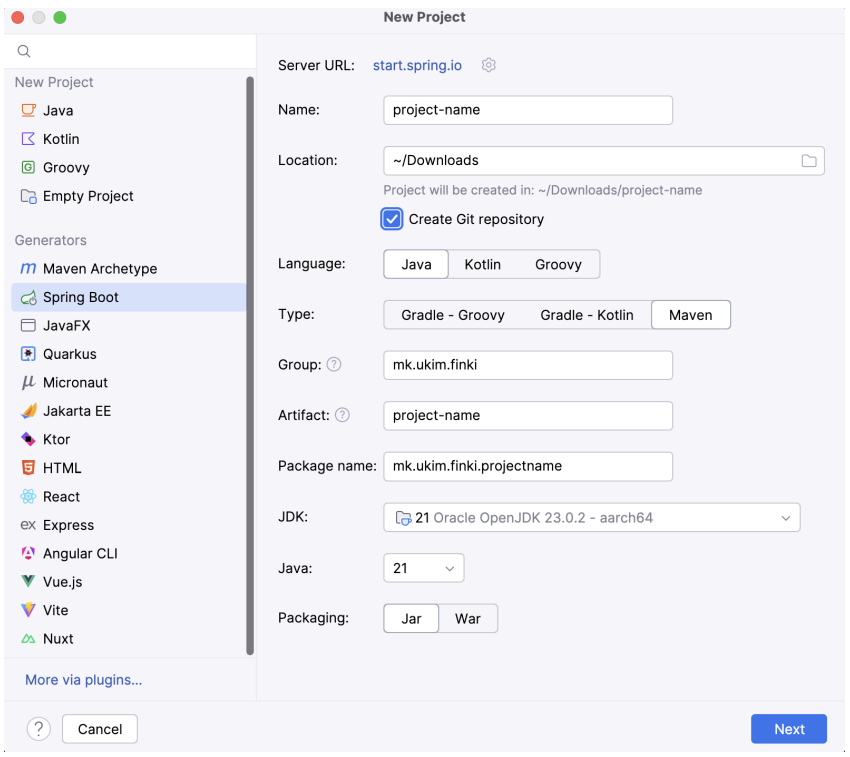
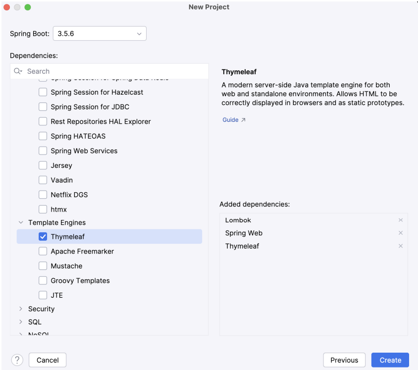

# Exercise 1

## Creating your first Spring Boot project







## First Servlet Project

### What We Built
A Spring Boot web app with two servlets: a simple greeting page and a category management system.

### 1. Project Configuration (`application.properties`)
```properties
spring.application.name=wp-2025
server.port=9090
```
- Changed default port from 8080 to 9090
- Named our application "wp-2025"

### 2. HelloWorldServlet - The Basics
```java
@WebServlet(name = "HelloWorldServlet", urlPatterns = {"", "/hello"})
public class HelloWorldServlet extends HttpServlet {
    @Override
    protected void doGet(HttpServletRequest req, HttpServletResponse resp) {
        String name = req.getParameter("name");
        String surname = req.getParameter("surname");
        
        if (name == null) name = "X";
        if (surname == null) surname = "Y";
        
        writer.format("<html><head></head><body><h1>Hello %s %s</h1></body></html>", 
                     name, surname);
    }
}
```

**What this does:**
- Maps to both root (`/`) and `/hello` URLs
- Reads `name` and `surname` from URL parameters
- Defaults to "X Y" if parameters missing
- Returns raw HTML string

**Try it:** `http://localhost:9090/hello?name=John&surname=Doe`

### 3. CategoryServlet - Real Application Logic

#### The Category Model (Inner Class)
```java
@Getter @Setter @AllArgsConstructor
class Category {
    private String name;
    private String description;
}
```
- Lombok annotations generate getters, setters, constructor
- Simple data holder for category info

#### In-Memory Storage
```java
private List<Category> categories = null;

@Override
public void init() throws ServletException {
    categories = new ArrayList<>();
    addCategory("Movies", "Movies category");
    addCategory("Books", "Books category");
}
```
- `init()` runs once when servlet starts
- Pre-populates with two default categories
- Uses ArrayList for temporary storage

#### GET Request - Display Categories
```java
@Override
protected void doGet(HttpServletRequest req, HttpServletResponse resp) {
    IWebExchange webExchange = JakartaServletWebApplication
            .buildApplication(getServletContext())
            .buildExchange(req, resp);
    
    WebContext context = new WebContext(webExchange);
    
    context.setVariable("ipAddress", req.getRemoteAddr());
    context.setVariable("userAgent", req.getHeader("user-agent"));
    context.setVariable("categories", categories);
    
    springTemplateEngine.process("categories.html", context, resp.getWriter());
}
```

**What happens:**
- Creates Thymeleaf context
- Passes client IP address to template
- Passes browser info (user-agent) to template
- Passes entire categories list to template
- Renders `categories.html` template

#### POST Request - Add New Category
```java
@Override
protected void doPost(HttpServletRequest req, HttpServletResponse resp) {
    String name = req.getParameter("name");
    String description = req.getParameter("description");
    
    addCategory(name, description);
    
    resp.sendRedirect("/servlet/category");
}
```

**What happens:**
- Extracts form data from POST request
- Calls `addCategory()` with validation
- Redirects back to GET (prevents duplicate submissions)

#### Input Validation
```java
private void addCategory(String name, String description) {
    if (name == null || name.isEmpty() || description == null || description.isEmpty()) {
        return;  // silently ignore invalid input
    }
    Category category = new Category(name, description);
    categories.add(category);
}
```

### 4. Thymeleaf Template (`categories.html`)

#### Displaying Variables
```html
<h2>
    <th:block th:text="'Hello ' + ${ipAddress}"/>
</h2>
<p>
    <th:block th:text="'User Agent: ' + ${userAgent}"/>
</p>
```
- `${ipAddress}` and `${userAgent}` come from servlet context
- String concatenation with `+` operator

#### Looping Through Categories
```html
<ul>
    <li th:each="category: ${categories}" 
        th:text="${category.name} + ' (' + ${category.description} + ')'">
    </li>
</ul>
```
- `th:each` iterates over categories list
- Accesses `name` and `description` properties via getters

#### Form for Adding Categories
```html

<form th:action="@{/servlet/category}" th:method="POST">
    <label>
        Name
        <input type="text" name="name"/>
    </label>
    <label>
        Description
        <input type="text" name="description"/>
    </label>
    <button type="submit">Add</button>
</form>
```
- `th:action="@{/servlet/category}"` generates correct URL
- Form inputs match parameter names in `doPost()`

## Key Concepts Demonstrated

1. **Servlet Lifecycle**: `init()` called once, `doGet()`/`doPost()` called per request
2. **URL Mapping**: `@WebServlet` annotation defines which URLs trigger servlet
3. **Request Parameters**: `req.getParameter()` extracts form/URL data
4. **Template Engine**: Thymeleaf processes HTML templates with dynamic data
5. **POST-Redirect-GET**: After POST, redirect to prevent form resubmission
6. **Constructor Injection**: SpringTemplateEngine injected via constructor

## Testing the Application
1. Start: `http://localhost:9090/servlet/category`
2. See: IP address, browser info, Movies/Books categories
3. Add: Fill form and submit
4. Result: New category appears in list